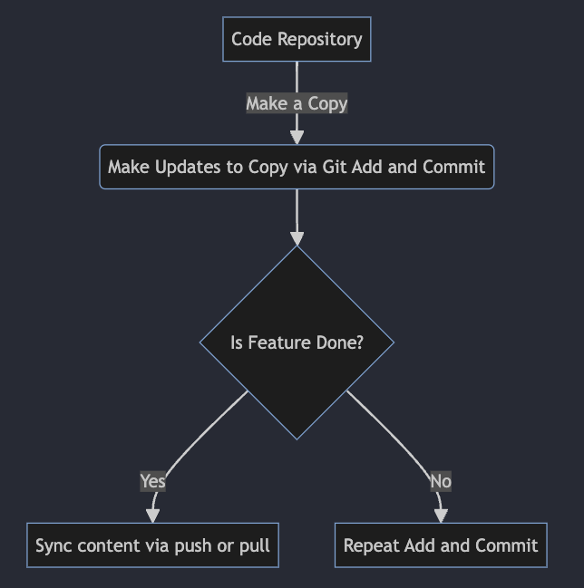

# Git Newbie Guide

An introduction to Git for folks who haven't quite figured out how to use Git in everyday use

If you ever feel too overwhelmed by the content, our guide has missed the mark. Git is as
equally powerful as it is confusing, and my goal is to make it as approachable as
possible. 😼

<iframe src="https://giphy.com/embed/l1KVaj5UcbHwrBMqI" width="480" height="269" style="" frameBorder="0" class="giphy-embed" allowFullScreen></iframe><p><a href="https://giphy.com/gifs/lifetimetv-adorable-babies-l1KVaj5UcbHwrBMqI">via GIPHY</a></p>

## Skip to the Good Stuff

Don't want to read below? Here's as quick and dry as I can think of getting with this.

You basically start using Git for a few scenarios:
- You want to work with others on things without stepping on each other's toes
- You want to save documents or other content on the web for consumption somewhere
- You want to use stuff others have created, either to tinker or use for building your own applications or otherwise



To start, you initialize Git to track changes within a folder.

```sh
git init

# Note: Repositories created in Github and Gitlab do this step for you automatically
```

Then, you will make updates to one or many files. Eventually, this will be something you care about and want to save for some reason.

The process you will regularly follow, repeatedly, until your "feature" is ready:

**Stage** the content to review what is about to be added
```sh
git add .
```

**Commit** the content, saving it and providing a brief message of what changed
```sh
git commit -m "a brief message about what you just did to the content
```

When doing these on your own computer or server, updates are saved locally. Occasionally you will need to synchronize content between your computer and some
remote location.

Pull the content from a remote location to your local computer.

```sh
git pull <remote-spot> <branch-name>
```

Users that work by themselves in a single repository often may push to a single "branch" of content, commonly called either *main* or *master*. To perform an update like this, the command would be:

```sh
git pull origin main
```

Push the content from your local computer to somewhere else

```sh
git pull <remote-spot> <branch-name>
```

Similarly to above, updating from `main` or `master` will be the same:

```sh
git push origin main
```

## Prerequisites

If you use a tool like Github or Gitlab, their website enables Git handling without you needing to learn how to do them yourself.

However, setting up a local environment to do updates within is usually quicker and more-responsive, and isn't as beholden to internet access and network speed. To set up Git on a computer, you will need:

- [Git Source Control Management (Git-SCM)](https://git-scm.com/downloads)
- An Integrated Developer Environment (IDE) like Visual Studio Code or equivalent

## What Does Git Do

The core value that Git provides is *Version Control* and *Team Collaboration*. Every update you make is done in the
form of a "commit", providing a powerful set of tooling options to those who can stomach the learning curve.

While daunting to learn, a <span style="color: red">meaningful amount of the value of Git can be leveraged by getting used to a few everyday commands.</span> Trust me - it is worth the effort...

<iframe src="https://giphy.com/embed/R6gvnAxj2ISzJdbA63" width="480" height="480" style="" frameBorder="0" class="giphy-embed" allowFullScreen></iframe><p><a href="https://giphy.com/gifs/warnerbrosde-R6gvnAxj2ISzJdbA63">via GIPHY</a></p>


## Key Concepts

### Initializing Git Tracking

Creating a project in Github or Gitlab will come with Git tracking by default. Content created elsewhere will need some Git tracking to be added

```sh
git init
```

This creates `/.git` folder wherever you are in your directory tree. Ignore this though - everything within there is spooky and unnecessary to learn about for now. Or ever, really... just, don't do it.

<iframe src="https://giphy.com/embed/zBqaukCE3oM1vW6twP" width="480" height="480" style="" frameBorder="0" class="giphy-embed" allowFullScreen></iframe><p><a href="https://giphy.com/gifs/HBOMax-hbomax-gordita-chronicles-on-zBqaukCE3oM1vW6twP">via GIPHY</a></p>

### Staging Updates

Staging is akin to writing a draft. Instead of working with one file though, you might have touched many.

First, see what is already staged, which will be nothing:

```sh
git status
```

Files in red are not tracked, meaning Git does not know they exist. To change this, add the things you want Git to start caring about:


```sh
# add pretty much everything in this folder, including all subfolders & the like

git add .
```

```sh
# add a bunch of things. in this case, all markdown:

git add *.md
```

```sh
# ...or just add a single file or two, ad-hoc style:

git add iAmAPotato.md myCatsAreGreat.sh
```

Type `git status` again and you should have your content hopefully highlighted in green, indicating it is now going to be tracked by Git.


### Commiting an Update

Once your draft files are ready, it is time to lock it in. We call this a commit. When we save a commit, you must leave a message about what changed.

```sh
git commit -m "some message about what changed"
```

> If you forget to provide the -m, you will likely enter "vi" mode and this view can be very confusing to people unfamiliar with how to use it.
>
> To exit this mode, type `:q!` and press **Enter**.

### Synchronizing Data

Pull the content from a remote location to your local computer.

```sh
git pull <remote-spot> <branch-name>
```

Users that work by themselves in a single repository often may push to a single "branch" of content, commonly called either *main* or *master*. To perform an update like this, the command would be:

```sh
git pull origin main
```

Push the content from your local computer to somewhere else

```sh
git pull <remote-spot> <branch-name>
```

Similarly to above, updating from `main` or `master` will be the same:

```sh
git push origin main
```

## Other Noteworthy Tidbits

- Git has "branches" which you can use to create copies of content to tinker and manipulate with, but this can be confusing and is best to avoid until ready to dive deeper into Git stuff
- There are many ways to leverage Git to automate tedious and boring tasks to documents. However, this is also outside the scope of this document.

## Clarifications

- Git is a set of tools that enable better, safer ways to edit and collaborate on content, but it does add extra process and confusion in doing so.
- Github and Gitlab are Git code repositories that let users save Git code, while also providing additional tooling and features for it.

## Feedback

How did I do? Hit the mark? Miss it entirely? Let me know! <button>Feedback</button>
